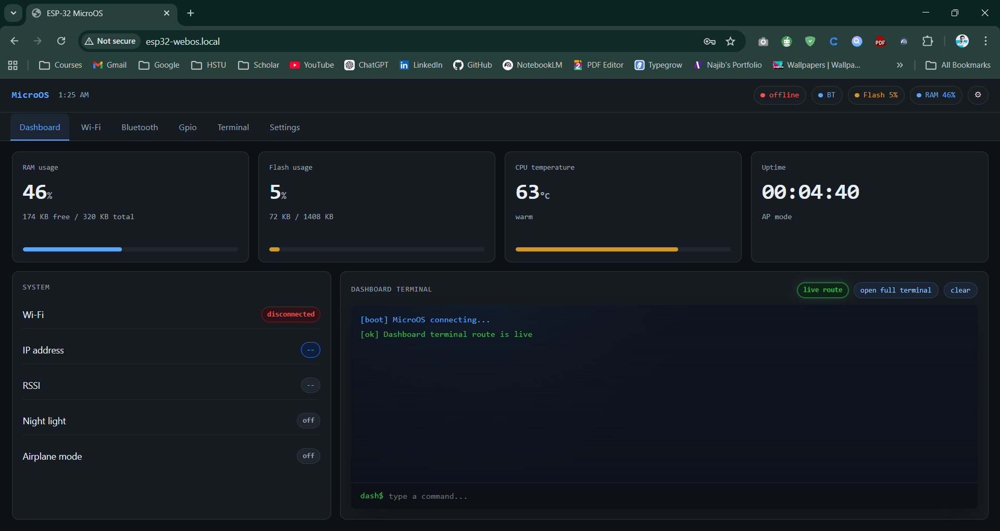

# ESP32 WebOS (Arduino IDE)

A full-featured ESP32 web control panel firmware with:
- AP-first onboarding flow
- Optional STA connection from dashboard
- Real-time GPIO control over WebSocket
- Terminal-like command interface
- OTA firmware update
- Session-based web authentication

This project is designed to boot into hotspot mode first, let you onboard Wi-Fi from the dashboard, and then use local access URLs.

## Preview

### Screenshot

### Demo Video

- Watch the demo on YouTube: [ESP32 WebOS Demo](https://youtu.be/63n1ate2iyo)

---

## Current Access Model

### AP onboarding mode (default boot)
- ESP32 starts hotspot
- Connect your phone/laptop to ESP32 AP
- Open dashboard using:
  - `http://esp32-connect.local` (preferred)
  - `http://192.168.4.1` (always fallback)

### STA mode (after joining home router from dashboard)
- ESP32 joins your router
- Access from devices on same LAN:
  - `http://esp32-webos.local`
  - or STA IP from serial log

---

## Features

- Responsive single-page WebOS-style UI
- Secure login with token-based session
- Session timeout support
- AP and STA runtime status
- Live system metrics:
  - RAM
  - Flash usage
  - CPU temperature
  - Uptime
- GPIO controls:
  - Select pins from grid
  - Toggle output pins directly
  - Set mode and PWM
- Terminal commands for GPIO/system/network
- OTA update from web dashboard
- mDNS hostnames for AP and STA modes
- Captive DNS support in AP mode for better hostname resolution

---

## Hardware Requirements

- ESP32 development board (recommended: ESP32-WROOM based boards)
- USB cable with data support
- Optional external load/LED for GPIO testing

---

## Software Requirements

- Arduino IDE 2.x
- ESP32 board package (tested on 3.3.8)
- Libraries used in sketch:
  - ESP Async WebServer
  - Async WebSocket
  - ArduinoJson
  - LittleFS (from ESP32 core)
  - Preferences (from ESP32 core)
  - ESPmDNS (from ESP32 core)
  - DNSServer (from ESP32 core)

---

## Important Configuration

Open `ESP32_WEBOS_ArduinoIDE.ino` and review these first:

- `MICROS_USERNAME`
- `MICROS_PASSWORD`
- `TOKEN_SECRET`
- `MICROS_HOSTNAME` (STA mDNS: `esp32-webos`)
- `AP_MDNS_HOSTNAME` (AP mDNS: `esp32-connect`)
- `AP_SSID`, `AP_PASSWORD`
- `STA_AUTOCONNECT_ON_BOOT` (currently AP-first mode)

### Recommended before production
- Set a strong password (replace `change-me-now`)
- Set a long random token secret
- Set your own AP password

---

## Build and Flash (Arduino IDE)

1. Open Arduino IDE.
2. Open `ESP32_WEBOS_ArduinoIDE.ino`.
3. Select your ESP32 board from Tools > Board.
4. Select correct COM port from Tools > Port.
5. Verify (compile).
6. Upload.
7. Open Serial Monitor at `115200` baud.

---

## First Boot Workflow

1. ESP32 boots in AP mode.
2. In Serial Monitor, confirm logs like:
   - `[wifi] AP: ...`
   - `[net] AP URL: http://192.168.4.1`
   - `[net] AP mDNS target: http://esp32-connect.local`
3. Connect laptop/phone to AP SSID (default: `ESP32-MicroOS`).
4. Open dashboard (`esp32-connect.local` or `192.168.4.1`).
5. Login.
6. Go to Wi-Fi page and connect to your router.
7. After STA connects, use `esp32-webos.local` on same LAN.

---

## Login

Default username is set in config (`MICROS_USERNAME`).

Default password is placeholder (`change-me-now`) and should be changed before real use.

---

## GPIO Control Guide

### From Grid
- Click a pin tile to select it.
- Selected pin is highlighted.
- If pin is OUTPUT, clicking toggles HIGH/LOW.
- Control fields auto-fill with selected pin info.

### From Controls
- Enter/select pin number
- Set mode (`OUTPUT`/`INPUT`)
- Set HIGH/LOW
- Set PWM duty (`0-255`)

### Notes
- Input-only pins (34, 35, 36, 39) are protected from invalid output-mode operations.

---

## Bluetooth Panel Status

Bluetooth section is currently UI-demo scan/pair visualization.
No real BLE/Classic pairing backend is implemented in this firmware version.

---

## Terminal Commands

Examples:
- `help`
- `gpio list`
- `gpio read 2`
- `gpio write 2 high`
- `gpio write 2 low`
- `gpio mode 2 output`
- `gpio pwm 2 128`
- `sys uptime`
- `sys heap`
- `sys temp`
- `wifi status`
- `wifi connect <ssid> <password>`
- `wifi disconnect`
- `settings nightlight on`
- `settings airplane off`

---

## API Endpoints (high-level)

Authentication/session:
- `/api/auth`
- `/api/logout`

System:
- `/api/status`
- `/api/reboot`
- `/api/ota`

Wi-Fi:
- `/api/wifi/scan`
- `/api/wifi/connect`
- `/api/wifi/disconnect`
- `/api/wifi/status`

GPIO:
- `/api/gpio`
- `/api/gpio/write`
- `/api/gpio/pwm`
- `/api/gpio/mode`

Settings:
- `/api/settings`

WebSocket channels:
- `/ws/terminal`
- `/ws/gpio`
- `/ws/status`

---

## Troubleshooting

### 1) `esp32-connect.local` does not open in AP mode
- Confirm connected to ESP32 hotspot.
- Check serial for AP heartbeat and clients count.
- Try fallback URL: `http://192.168.4.1`.
- Some clients still handle `.local` differently; AP IP is always valid fallback.

### 2) `esp32-webos.local` does not open in STA mode
- Ensure ESP32 is connected to router (`connected: yes` in serial).
- Ensure your device is on same LAN.
- Try STA IP directly from serial.
- On Windows, mDNS/Bonjour availability affects `.local` discovery.

### 3) Cannot login
- Confirm configured username/password in sketch.
- Reflash after changing config values.
- Clear browser cache/session and retry.

### 4) GPIO not changing
- Check if selected pin is output-capable.
- Verify wiring/load.
- Watch terminal logs for command response.

---

## Project Structure

- `ESP32_WEBOS_ArduinoIDE.ino` : main firmware and embedded Web UI
- `src/image/webos.png` : screenshot asset
- YouTube demo: https://youtu.be/63n1ate2iyo

---

## Security Notes

Before any real deployment:
- Change default login credentials
- Change token secret
- Use a strong AP password
- Keep OTA restricted to authenticated sessions

---

## Versioning and Maintenance

If you continue feature development, recommended next steps:
- Real BLE backend integration
- Persistent user management (hashed credentials in NVS)
- Optional TLS reverse proxy in front of ESP32
- Structured build documentation for board variants
